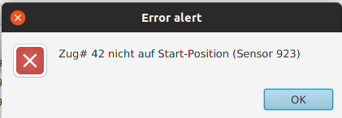

# Fahrplan-Start

Vom Fahrplan-Fenster aus kann einer der Fahrpläne, die im Panel.XML File gespeichert
sind, gestartet werden und auch gestoppt werden.

Links neben dem Startbutton findet sich die Anzeige (rot/grün) für die Gleisspannung -
durch Click auf diese Anzeige kann die Gleisspannung ein- und ausgeschaltet werden.

Falls die Gleisspannung nicht eingeschaltet ist, kann natürlich auch keine Lok gestartet
werden, in diesem Fall erscheint die Fehlermeldung

Beim Click auf Start wird außerdem gecheckt, ob die richtigen (im Fahrplan 
verwendeten Züge bzw Loks) auch auf dem richtigen Gleis (bzw Sensor) stehen, sonst erscheint
eine Fehlermeldung wie zum Beispiel:

Für den Beispiel-Fahrplan müssen zu Beginn diese Züge auf den richtigen 
"Start-Sensoren" stehen

* *Zug 42 auf Sensor 923* (für Fahrt 3102)
* *Zug 29 auf Sensor 902* (für Fahrt 3101) 
* *Zug 40 auf Sensor 922* (für Fahrt 3104) 

Falls die Positionen nicht stimmen, so kann das 2 Gründe haben:

1. die Züge stehen wirklich nicht richtig
2. die Positionen sind dem Programm noch nicht bekannt
(oder beides)

### =>> weiter zu [Zug setzen](05-Zug_setzen.md)

___

